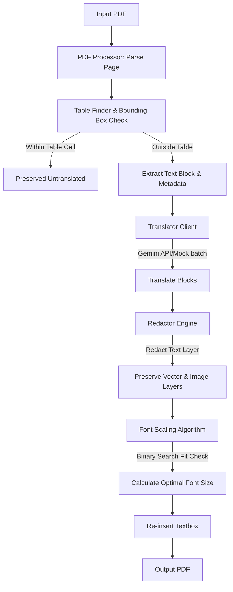

# Python PDF Translation Pipeline

A robust, layout-preserving PDF translation pipeline designed specifically for highly structured documents such as service manuals, datasheets, and technical guides. 

Built on top of **PyMuPDF (fitz)** and **Google GenAI (Gemini)**, the pipeline automatically detects and translates text blocks, erases original text via PDF redaction while preserving the background layer, and dynamically scales fonts and wraps text to fit perfectly in the original page geometry.

---

## Key Features

1. **Geometry-Preserving Translation**: Extracts text with precise bounding box coordinates and re-inserts the translation in the exact same coordinates.
2. **Table and Graphic Exclusion**:
   - Automatically detects tabular structures (using PyMuPDF's table finder) and excludes table text from translation.
   - Filters out image objects and vector art from the translation process.
3. **Background Preservation**: Uses PDF byte-level text redaction annotations (without fill blocks) to erase the original source text while keeping background colors, graphics, and images completely intact.
4. **Dynamic Font Scaling**: Implements an iterative binary search text-fitting algorithm. It adjusts the font size down to a minimum size (default: `4.0`) to ensure translated text fits entirely inside the original coordinates without overflow or document corruption.
5. **Batch Translation**: Groups block translation requests to optimize Gemini API calls, reducing network roundtrips and avoiding rate limit exhaustion.
6. **Graceful Failbacks**: Integrates a local mock translator mode for layout/scaling testing or running without an active Gemini API key.

---

## Architecture Diagram



---

## Project Structure

- `requirements.txt`: Python package requirements.
- `config.py`: Environment variable loading, default language/font parameters.
- `translator.py`: Handles Gemini client interface, batch logic, and mock translator fallback.
- `pdf_processor.py`: Core processing pipeline: parsing, table checking, redaction, font scaling, and re-insertion.
- `cli.py`: Command Line Interface entry point.
- `test_pipeline.py`: Automated self-tests creating a dummy manual page to verify compliance.

---

## Installation

1. Clone or navigate to the project directory:
   ```bash
   cd pdf_translator_pipeline
   ```

2. Create a virtual environment and activate it:
   ```bash
   python -m venv .venv
   # Windows:
   .venv\Scripts\activate
   # Linux/macOS:
   source .venv/bin/activate
   ```

3. Install the dependencies:
   ```bash
   pip install -r requirements.txt
   ```

---

## Configuration

To use the Google GenAI Gemini API, copy the `.env.example` file to `.env` or set the environment variable:

```bash
# Windows PowerShell
$env:GEMINI_API_KEY="your-api-key-here"

# Windows CMD
set GEMINI_API_KEY=your-api-key-here

# Linux/macOS
export GEMINI_API_KEY="your-api-key-here"
```

---

## Usage Instructions

Run the application using the CLI:

```bash
python -m pdf_translator_pipeline.cli <input_pdf_path> [output_pdf_path] [options]
```

### CLI Arguments & Options

| Argument / Option | Short | Description |
| :--- | :--- | :--- |
| `input_pdf` | None | **Required**. Path to the source PDF file. |
| `output_pdf` | None | *Optional*. Path to save the translated PDF. Defaults to `<input_name>_translated.pdf`. |
| `--target-lang` | `-t` | Target language code (e.g., `es` for Spanish, `de` for German, `fr` for French). Default: `es`. |
| `--source-lang` | `-s` | Source language code (e.g., `en` for English) or `auto` for auto-detect. Default: `auto`. |
| `--model` | `-m` | Gemini model name. Default: `gemini-2.5-flash`. |
| `--api-key` | `-k` | Pass the Gemini API Key directly via CLI command instead of environment variable. |
| `--mock` | None | Force use of the offline mock translator (does not require an API key). Useful for testing styling and font scaling. |
| `--batch-size` | `-b` | Number of text blocks to translate per API request. Default: `30`. |

### Examples

**Translate to Spanish using Gemini API (requires environment variable set):**
```bash
python -m pdf_translator_pipeline.cli service_manual.pdf
```

**Translate to German using a specific API Key:**
```bash
python -m pdf_translator_pipeline.cli manual.pdf manual_de.pdf -t de -k AIzaSy...
```

**Run layout verification using Mock Mode (Offline):**
```bash
python -m pdf_translator_pipeline.cli manual.pdf --mock
```

---

## Running the Verification Test Suite

To verify table exclusion, vector graphic preservation, and font scaling, run the automated test suite:

```bash
python -m pdf_translator_pipeline.test_pipeline
```
*(Runs an end-to-end integration test creating a dummy service manual PDF, translating it in mock mode, and asserting layout properties.)*
